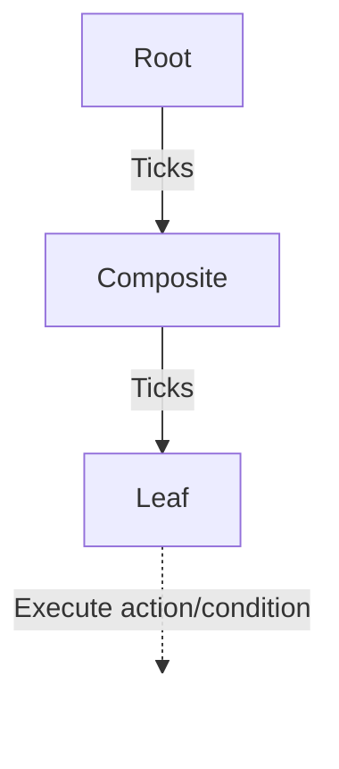
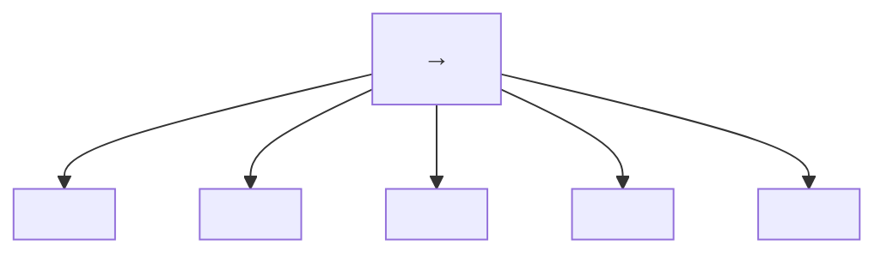
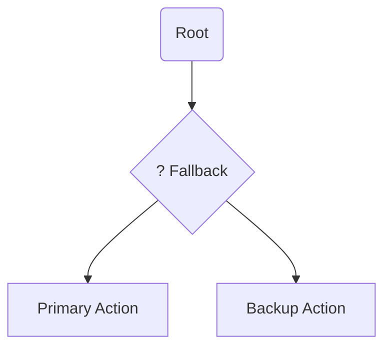
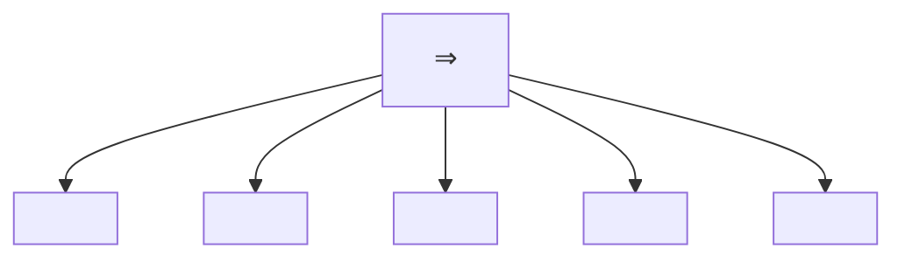
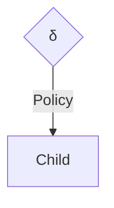

 
The structure will be:

* Robot and Human modelling
* Intention detection and expression
* Verbal communication
* Decision making
* Learning human behavior
* Task sharing and use cases
* Safety and ergonomics
* Ethics

# Lecture 1: Introduction

HRI = even more interdisciplinary than Robotics because we take the social world in consideration and the interactions the robot has with humans.

>[!summary] HRI
>
>* Robotics,
>* Philosophy,
>* Humans,
>* Design,
>* AI,
>* HCI (Human Computer Interaction) i.e. Sociology \& Anthropology

> Robotics $\leftarrow$ Robots navigate and manipulate the physical world

> HRI $\leftarrow$ Robots interact with people in the social world

There's levels to this shit

    

  
  

    <ul>
      <li><b>Scientists</b> combine the goal of <b>Understanding the World</b> with <b>Explicit Knowledge</b> to develop theories on how humans perceive robots and use the <b>Human</b> axis to conduct controlled behavioral studies.</li>
      <li><b>Engineers</b> focus on <b>Transforming the World</b> through <b>Technology</b> and <b>Explicit Knowledge</b>, prioritizing the development of robust hardware and reliable software architectures that allow the robot to function.</li>
      <li><b>Designers</b> bridge the gap by utilizing <b>Implicit Knowledge</b> and the <b>Human</b> axis to ensure the interaction is intuitive, focusing on the "how it feels" aspect of the robot's presence in a social environment.</li>
    </ul>
  

---

# Lecture 2: Robot Modelling

>[!summary] Robot Modelling
>
>* Robot morphology and types
>* Sensors and outputs
>* Kinematics
>* Challenges

Therefore, we could define a robot as an autonomous machine capable of sensing its environment, carrying out computations to make decisions, and performing actions in the real world.

### Hardware: Robot Morphology

The **Uncanny Valley** is a critical concept in HRI that dictates how important robot morphology is.

    

- **Affinity and Likeness**: As a robot becomes more human-like, our affinity for it increases.
- **The Dip**: When a robot is "almost" human but not quite perfect, there is a sharp drop in affinity where it becomes creepy or repulsive (labeled as "corpse" or "zombie" levels).
- **The Movement Multiplier**: Movement (the dashed line) amplifies these feelings. A likable robot becomes more endearing when it moves, but a creepy robot becomes significantly more disturbing.

### Software: Sensors and outputs

Here we have 3 possible architectures:

* **Reactive** (simply sense using the sensors and then act using actuators). Open loop.
* **Sense-Plant-Act** (Introduce the Planning phase to the prior concept). It's also closed-loop.
* **Behavior-Based** (Here we already have decision-making abilities such as avoiding objects or exploring the world).

### Robot Modelling: Forward Kinematics

We describe the pose of the end-effector using a 4x4 transformation matrix (affine transformation -- it makes transformations from one state to another simpler by combining the Rotation and Translation vectors into one matrix)

$$
T = \left[ \begin{array}{c|c} 3 \times 3 & 3 \times 1 \\ \hline 1 \times 3 & 1 \times 1 \end{array} \right] = \left[ \begin{array}{ccc|c} & & & posi \\ & orientation & & - \\ & & & tion \\ \hline 0 & 0 & 0 & 1 \end{array} \right]
$$

**Forward Kinematics** is the process of calculating the final position and orientation of the **end effector** (the robot's "hand") based on the angles of its joints ($q$) and the lengths of its links ($l$).

* **Chaining Transformations**: We calculate individual transformation matrices for each joint $(R_0^1​,R_1^2​,R_2^3​,R_3^4​$) and multiply them together to get the total transformation $(R_0^4​)$.
* The final matrix is a function of joint positions $(q_1, q_2, q_3)$ and link lengths $(l_1,l_2,l_3)$.

### Example

    

> Simply understand what each value represents in the following steps and where it should be inserted if we want a Rotation around an axis or a translation along another.

**Step 1: Base Frame to Joint 1**

This represents a translation along the Z-axis and a rotation around the X-axis.

$$
R_{0}^{1} = Trans(Z, 1)R(X, q_{1}) = \begin{bmatrix} 1 & 0 & 0 & 0 \\ 0 & 1 & 0 & 0 \\ 0 & 0 & 1 & 1 \\ 0 & 0 & 0 & 1 \end{bmatrix} \begin{bmatrix} 1 & 0 & 0 & 0 \\ 0 & c_{1} & -s_{1} & 0 \\ 0 & s_{1} & c_{1} & 0 \\ 0 & 0 & 0 & 1 \end{bmatrix}
$$

**Step 2: Joint 1 to Joint 2**

This involves a translation along the Y-axis by the length of the first link (l1​) and a rotation around the X-axis.

$$
R_{1}^{2} = Trans(Y, l_{1})R(X, q_{2}) = \begin{bmatrix} 1 & 0 & 0 & 0 \\ 0 & 1 & 0 & l_{1} \\ 0 & 0 & 1 & 0 \\ 0 & 0 & 0 & 1 \end{bmatrix} \begin{bmatrix} 1 & 0 & 0 & 0 \\ 0 & c_{2} & -s_{2} & 0 \\ 0 & s_{2} & c_{2} & 0 \\ 0 & 0 & 0 & 1 \end{bmatrix}
$$

**Step 3: Joint 2 to Joint 3**

This follows the same pattern, translating by link length $l_2$​ and rotating by joint angle $q_3$​.

$$
R_{2}^{3} = Trans(Y, l_{2})R(X, q_{3}) = \begin{bmatrix} 1 & 0 & 0 & 0 \\ 0 & 1 & 0 & l_{2} \\ 0 & 0 & 1 & 0 \\ 0 & 0 & 0 & 1 \end{bmatrix} \begin{bmatrix} 1 & 0 & 0 & 0 \\ 0 & c_{3} & -s_{3} & 0 \\ 0 & s_{3} & c_{3} & 0 \\ 0 & 0 & 0 & 1 \end{bmatrix}
$$

**Step 4: Final Tool Tip Translation**

This final matrix accounts for the length of the end effector link ($l_3$​).

$$
R_{3}^{4} = Trans(Y, l_{3}) = \begin{bmatrix} 1 & 0 & 0 & 0 \\ 0 & 1 & 0 & l_{3} \\ 0 & 0 & 1 & 0 \\ 0 & 0 & 0 & 1 \end{bmatrix}
$$

**Final Result: Forward Kinematics Matrix ($R_0^4$​)**

This is the combined matrix representing the total position and orientation of the end effector relative to the base.

$$
R_{0}^{4} = \begin{bmatrix} 1 & 0 & 0 & 0 \\ 0 & c_{1,2,3} & -s_{1,2,3} & l_{3}c_{1,2,3} + l_{2}c_{1,2} + l_{1}c_{1} \\ 0 & s_{1,2,3} & c_{1,2,3} & l_{3}s_{1,2,3} + l_{2}s_{1,2} + l_{1}s_{1} + 1 \\ 0 & 0 & 0 & 1 \end{bmatrix}
$$

Therefore, we can deduce the definition:

>[!summary] Forward Kinematics
>The FKM is a transformation matrix, a function of the joint positions and link lengths. If we know these variables, we can calculate the position and orientation of the end effector (or any other point).

**Denavit-Hartenberg (DH) convention**

The Denavit-Hartenberg convention define the relationship between consecutive joint frames, specifically from joint $i$ to joint $i+1$. It reduces the transformation between links to four specific parameters.

- **$d_i$​ (Joint offset)**: The length along the Z-axis from joint i to joint i+1.
- **$\theta_i$​ (Joint angle)**: The rotation around the Z-axis between joint i and joint i+1.
- **$r_i$​ (Link length)**: The distance along the X-axis from joint i to joint i+1.
- **$\alpha_i$​ (Link twist)**: The angle around the X-axis from joint i to joint i+1.

$$
T_{i}^{i+1} = Rx(\alpha_{i}) \cdot Tx(r_{i}) \cdot Rz(\theta_{i}) \cdot Tz(d_{i})
$$

**Robot Velocity: The Jacobian**

The Jacobian is specifically defined as a $6\times n$ matrix, where $n$ is the number of joint velocities. It relates joint velocities ($\dot q$​) to the 6D end-effector velocity vector ($\zeta$) consisting of three linear velocities ($u$) and three angular velocities ($\omega$).

$$
\begin{bmatrix} \dot{x} \\ \dot{y} \\ \dot{z} \\ \omega_{x} \\ \omega_{y} \\ \omega_{z} \end{bmatrix} = \xi = J\dot{q} = J \begin{bmatrix} \dot{q}_{1} \\ \dot{q}_{2} \\ \vdots \\ \dot{q}_{n} \end{bmatrix}
$$

### Inverse Kinematics

The primary distinction between the two models is the direction of the calculation:

>[!question] Difference between Forward and Inverse Kinematics
> * **Forward Kinematics**: specific coordinate values are given to each joint $\rightarrow$ where the end-effector will be located
> * **Inverse Kinematics**: desired end-effector position $\rightarrow$ what the joint coordinate values should be

$$
g(P_{x}, P_{y}, P_{z}, \phi, \theta, \psi) \mapsto q = [q_{1}, q_{2}, \dots, q_{n}]
$$

> As a rule of thumb, the end-effector is the **terminal component** that facilitates the robot's **interaction with its environment** to accomplish its specific mission.

### Example of Forward and Inverse Kinematics Modelling for a mobile robot (differential drive)

    

The robot's state in the environment is defined by its **Pose ($P$)**, and its movement is dictated by the **Control Input ($U$)**.

- **Pose ($P$)**: The robot's position $(x,y)$ and its orientation angle $(\theta)$ in the global frame.
- **Control Input ($U$)**: Consists of the robot's linear velocity ($U$) and its angular velocity ($\Omega$).

In differential drive, to follow a trajectory, the robot rotates around an **Instantaneous Center of Rotation (ICR)** which is the point around which the robot appears to be rotating at a specific moment. 

**Rotation Radius (R)**: The distance from the ICR to the center of the robot. It is determined by the wheel velocities $(U_r​,U_l​)$ and the distance between wheels $(L)$.

**Forward Kinematics**:

If we define $r = U_r + U_l$, the final step combines these relations into a single matrix that maps the **rotational velocities of the wheels** $(\omega_r, \omega_l​)$ to the **robot's overall velocities** $(U,\Omega)$.

$$ 
\begin{bmatrix} U \\ \Omega \end{bmatrix} = \begin{bmatrix} \frac{r}{2} & \frac{r}{2} \\ \frac{r}{L} & \frac{-r}{L} \end{bmatrix} \begin{bmatrix} \omega_{r} \\ \omega_{l} \end{bmatrix} 
$$

**Inverse Kinematics**:

Inverse kinematics for a differential drive robot involves calculating the individual wheel velocities ($\omega_r, \omega_l$​) required to achieve a desired global robot motion $(U, \Omega)$ or a specific rotation radius $(R)$.

$$
\omega_{r} = \Omega \frac{R + \frac{L}{2}}{r} = U \frac{1 + \frac{L}{2R}}{r}
$$

$$
\omega_{l} = \Omega \frac{R - \frac{L}{2}}{r} = U \frac{1 - \frac{L}{2R}}{r}
$$

> It's basically writing the output in terms of the input.

And if we define the kinematics model in the world frame in terms of a homogenous transformation, we get

$$
\begin{bmatrix} \dot{x} \\ \dot{y} \\ \dot{\theta} \end{bmatrix} = \begin{bmatrix} \cos\theta & 0 \\ \sin\theta & 0 \\ 0 & 1 \end{bmatrix} \begin{bmatrix} U\\ \Omega \end{bmatrix} = \begin{bmatrix} \cos\theta & 0 \\ \sin\theta & 0 \\ 0 & 1 \end{bmatrix} \begin{bmatrix} \frac{r}{2} & \frac{r}{2} \\ \frac{r}{L} & -\frac{r}{L} \end{bmatrix} \begin{bmatrix} \omega_{r} \\ \omega_{l} \end{bmatrix} = \begin{bmatrix} \frac{r \cos\theta}{2} & \frac{r \cos\theta}{2} \\ \frac{r \sin\theta}{2} & \frac{r \sin\theta}{2} \\ \frac{r}{L} & -\frac{r}{L} \end{bmatrix} \begin{bmatrix} \omega_{r} \\ \omega_{l} \end{bmatrix}
$$

### How do we estimate the pose when we have noise? Slap a Kalman Filter

$$
X_k = AX_{k-1} + BU_{k-1} + w_k
$$

$$
Y_k = HX_k + v_k
$$

where $w_k$ is the **process noise** and $v_k$ is the **measurement noise**

The noise signals $w_k$, $v_k$ are considered to be normally distributed with zero means and covariance matrices $Q$ and $R$ respectively. We talk about covariance when we have multiple states and we have to estimate noise for each of them. 

> Basically, it's a way to introduce uncertainty in our modelling.

In the ROS ecosystem, localization is organized through a standardized hierarchy of coordinate frames to ensure different sensors and algorithms can communicate effectively. This structure follows a specific chain: **earth $\rightarrow$ map $\rightarrow$ odom $\rightarrow$ base_link**.

* **earth**: Can be used for connecting multiple robots on different maps
* **map**: Calculated based on discontinuous sensors (e.g. GPS)
* **odom**: Calculated based on continuous sensors, (e.g. IMUs)
* **base_link**: Attached on the robot, as forward, left, up

There are also two ROS standard systems:

* **REP 103**: Defines standard units of measure and coordinate conventions.
* **REP 105**: Specifically defines the coordinate frames for mobile platforms mentioned above.

### Lagrangian of a robot

The **Lagrangian** of a robot provides a condensed way to describe its dynamic behavior, relating the forces or torques acting on the joints to the resulting motion.

The general dynamic equation:

$$
D(q)\ddot{q} + C(q, \dot{q})\dot{q} + g(q) = \tau
$$

* The matrix $D$, contains information about the inertia of the system, therefore contains all the masses and moments of inertia.
* The matrix $C$ has elements related to the centrifugal and Coriolis terms.
* $g(q)$ (Gravity Vector): This term represents the dependence of the robot's potential energy on its position, accounting for gravity.
* $\tau$ (Torque): The vector of generalized forces or torques applied to the joints

This equation above is the **inverse dynamics** where we want to know what torque $\tau$ should be applied to achieve a specific acceleration $\ddot q$. You use this to determine how much power your motors must output to move the robot in a specific way.

The **forward dynamics** tells us what acceleration $\ddot q$ we get if we apply a specific torque $\tau$. You use this primarily for simulation to see how the robot will actually react to motor inputs.

$$
\ddot{q} = D(q)^{-1} \left( \tau - C(q, \dot{q})\dot{q} - g(q) \right)
$$

---

# Lecture 3: Human Modelling

### Musculoskeletal Modelling

We assume that the skeleton is formed by multiple **non-deformable bodies** moving under external forces.

>[!question] But how come we have motion if we have rigid, non-deformable bodies?
>
> * We talk in terms of **degrees of freedom (DOF)**

### Mood, emotions, and expressions

How can robots detect emotion? By placing markers over our face and the relative position of this markers are fed into a NN.

### Culture

When designing HRI applications, culture must be identified and respected.

---

# Lecture 4: Intention Detection and Expression

This diagram illustrates a **Shared Control** framework in Human-Robot Interaction (HRI), specifically focusing on how authority is divided between a person and an autonomous agent.

    

The top section shows the communication loop where the human provides **Intent** (commands or guidance) and receives **Feedback** (visual, haptic, or auditory) from the robot. At the center, the **Arbitration** mechanism—depicted as a dial—determines the level of assistance or control. The variables $W_H$​ and $W_R$​ represent the relative **weights** or influence each party has over the final action taken within the shared **Environment**.

> Essentially, it models how a system decides when to follow the human's lead versus when the robot should intervene to optimize performance or safety.

>[!question] What is the difference between implicit and explicit intention?
>
>Explicit intention is easy
>
>* Buttons
>* Predefined Gestures
>* Voiced Commands
>* Force Inputs

So how do we measure implicit intention? Implicit intentions are subconscious cues that a robot can use to anticipate a person's next move.

For example, **Gaze and Eye Tracking** monitors where a person looks to predict their target or focus of attention before they even move. **EEG** (Electroencephalography) records brain activity to detect motor preparation signals. **EMG**(Electromyography) measures the electrical activity in muscles, catching the very beginning of a physical movement. **Kinematics** analyzes the geometry of motion, such as velocity and trajectory, to identify patterns in how a person is moving.

Most advanced systems use a **Combination** of these sensors to increase the accuracy of the robot's "understanding" of the human.

    

> In **EEG**, multiple challenges arise. EEG allows for the direct, non-invasive measurement of brain activity.

* Direct measurement of brain activity
* Non-invasive
* High temporal resolution
* Low spatial resolution
* Susceptible to noise and artifacts
* Requires extensive training and calibration

**From EEG to EMG**:

    

A **motor unit** is the connection between a motor neuron and a skeletal muscle.

EMG provides a **direct measurement of muscle activation**, allowing a robot to sense a movement intention before physical motion even occurs. Compared to brain-sensing (EEG), it is **easier to interpret** and offers **high temporal resolution**, meaning there is very little delay between the muscle firing and the signal being recorded. Additionally, it is a **portable and relatively low-cost** solution for real-world applications.

On the technical side, EMG is **susceptible to noise, artifacts, and crosstalk**, where signals from neighboring muscles interfere with the data. It also has **limited spatial resolution**, making it difficult to pinpoint exact muscle fibers. Furthermore, **muscle fatigue** can change the electrical signal over time, which may lead to inaccuracies if the system isn't calibrated to account for it.

By **combining** these techniques, we can convert low-level signals (EEC, EMG, kinematics) to high-level semantics (e.g., ”pick up the cup”).

For **interpreting intention**, we need some key considerations:

* The system must be **Context-aware** to distinguish between a deliberate movement and a random gesture. Because biological signals vary significantly between individuals, **User-specific models** are required for accurate decoding. To avoid dangerous lags in robot response, the data requires **Real-time processing**. Systems also need robust **Uncertainty handling** to decide what to do when signals are noisy or ambiguous. Finally, **Ethical considerations** must be addressed regarding data privacy and the autonomy of the human user.

>[!question] Why is it important for robots to express their intention? How can robots express their intention?
>
>Robots express what they are about to do through several channels:
>
>* **Visual cues**: Using lights, colors, or digital displays to indicate status or intended direction.
>* **Auditory cues**: Utilizing specific sounds or synthesized speech to communicate with the user.
>* **Haptic feedback**: Providing physical sensations like vibrations or resistive forces (often used in shared steering or teleoperation).
>* **Movement patterns**: Using "legible motion," where the robot's physical trajectory is designed to be easily understood by a human observer.
>
>This two-way communication—the robot sensing the human's **Implicit Intention** and the human receiving the robot's **Expressed Intention**—is what allows for a smooth, high-performance shared control system.

# Lecture 5: Arbitration

Reminder of the different types of **Implicit and Explicit Intention**

    

> Reminder of the **arbitration** concept: The division of control among agents when attempting to accomplish some task. For HRI: how control is divided between human and robot.

When we talk about arbitration, we need to touch on these concepts:

* **Level of arbitration**: What is being shared? (e.g., goal, trajectory, low-level control, task allocation)
	* **Goal-level arbitration**: Human selects high-level goals, robot plans and executes actions to achieve them.
	* **Trajectory-level arbitration**: Human provides waypoints or trajectories, robot refines and executes them.
	* **Low-level control arbitration**: Human and robot share control of actuators.
	* **Task allocation arbitration**: Human and robot divide tasks based on capabilities and preferences.
* **Timing of arbitration**: When is control shared? (e.g., continuous, discrete)
	* **Continuous arbitration**: Control is shared continuously, with both agents contributing simultaneously.
	* **Discrete arbitration**: Control is switched between agents at specific times or events.
* **Decision mechanism**: How is control shared? (e.g., fixed, adaptive)
	* **Fixed arbitration**: Control sharing is predetermined and does not change during the task.
	* **Adaptive arbitration**: Control sharing adjusts based on context, performance, or agent states.
	* Examples: 
		* Feeding robot learning user’s preferred eating rate
		* Robot learning from human how to best hand over tools
		* Understand learning style and adapt level of intervention

### Arbitration Strategies

**Authority-based Approaches**

* **Fixed**: Assign different levels of control to each agent.
* **Switching**: Alternate control between agents based on explicit input.
* **Dynamic**: Adjust control levels based on task phase, confidence

**Blending Approaches**

  
  

    <ul>
      <li><b>Weighted summation</b>: Combine inputs from both agents based on weights </li>
      <li><b>Assistive Guidance</b>: Robot applies forces to guide human actions.</li>
    </ul>
  

> Arbitration can also occur at different degrees of freedom.

**Learning-based Approaches**

* **Reinforcement learning**: Learn optimal arbitration policy through trial and error.
* **Imitation learning**: Learn arbitration strategy by observing human demonstrations.
* **Predictive**: Anticipate human actions and adjust robot control accordingly.

**Physical Arbitration**

* **Haptic shared control**: Use haptic feedback to convey robot intentions and assist human.
* **Impedance control**: Modulate robot’s mechanical impedance based on human input.
* **Admittance control**: Adjust robot’s motion in response to human forces.

>[!question] When to choose one of these strategies? Which factors influence the decision?
>
>* **Intentions**: Aligned vs. conflicting
>	* The system must detect whether human and robot intentions are **aligned or conflicting**. If intentions align, a **blending approach** like weighted summation works well to enhance performance. If they conflict, the system needs a **decision mechanism** (like adaptive arbitration) to determine which agent has the most reliable information at that moment.
>* **Environment**: Static vs. dynamic, complexity, uncertainty
>	* A **static environment** may only require **fixed arbitration**, where roles are predetermined. However, in **dynamic or complex environments** with high uncertainty, **predictive or learning-based approaches** are superior because they allow the robot to anticipate human needs and adjust control levels on the fly.
>* **Human**: Skill level, cognitive load, preferences, fatigue
>	* Choosing a strategy requires assessing the human's **skill level, cognitive load, and fatigue**. For a novice with high cognitive load, **assistive guidance** or haptic shared control can reduce effort. For an expert, **switching control** might be better to allow the human full autonomy until they explicitly request robot intervention.
>* **Robot**: Autonomy level, capabilities, reliability
>	* The choice is limited by the robot's **autonomy level and reliability**. A highly reliable robot can handle **goal-level arbitration**, where the human just sets the target. If the robot is less certain, **low-level control arbitration** is safer, keeping the human "in the loop" to provide continuous corrections.

The following criteria ensure that the division of control between human and robot is effective, safe, and socially responsible.

- **Transparency**: The system must ensure the human clearly understands why a robot is taking specific actions.
- **Trust**: It is essential to build and maintain the human's confidence in the robot's capabilities to ensure effective collaboration.
- **Responsiveness**: The arbitration strategy must be able to adapt quickly to changing environmental conditions or new human inputs.
- **Safety**: A primary goal is to prevent any physical or operational harm to the human user or the surrounding environment.
- **Smoothness**: The system should ensure seamless transitions when control shifts between the human and the robot.
- **Ethical considerations**: Designers must address the complex question of who is legally or morally responsible for actions taken while under shared control.

---

# Lecture 6: Software Architectures in HRI

### Control Paradigms

### Behavior-Based Control Paradigms

> Addresses how a robot manages multiple, often competing, tasks or reactions simultaneously. It focuses on the transition from simple sensing to complex action selection

>[!summary] Reactive Control i.e. Behavior
>
>A small program that read sensor data and control the actuators of the robot. Each behavior deals with just one simple thing.

It works on the following principle:

$$
\text{Stimulus} <=> \text{Reaction}
$$

What happens when we have many behaviors?

    

We need to prioritize! Important behaviors should inhibit/override/subsumate less important ones

When a robot is equipped with many behaviors—such as "avoid obstacles," "follow path," and "find dock"—it cannot execute all of them at once with equal priority. The diagram illustrates a parallel structure where environmental data is processed by multiple behavior modules simultaneously.

To prevent conflicting commands to the actuators, the system must prioritize. This is often achieved through **Subsumption**: higher-level, more critical behaviors (like "emergency stop" or "collision avoidance") have the power to **inhibit**, **override**, or **subsume** lower-level ones. This ensures that safety-critical actions take precedence over general task goals.

> So basically, a state machine

    

>[!NOTE] Behavior-Based/Reactive Control Advantages vs Disadvantages
>
>**Advantages**
>
>* Simple programs, easy to write
>* Incremental development
>* Real-time reactions
>* Simple behaviors can rise to complex intelligence like behavior
>
>**Disadvantages**
>
>* Hard to implement goal-oriented tasks
>* Complicated to debug
>* Priority definition might be context dependent

### Sense-Perceive-Plan-Act (SPPA) Framework

It's a classic serial control paradigm in robotics. Unlike the parallel "Behavior-Based" approach, this model functions as a linear pipeline.

    

In this architecture, information flows sequentially from the environment to the robot's actuators:

- **Sense**: The robot gathers raw data from the environment using its sensors.
- **Perceive**: The system processes that raw data to understand its surroundings (e.g., identifying objects or human presence). Sounds like segmentation to me.
- **Plan**: Based on its perception, the robot calculates the best course of action or trajectory to achieve a goal.
- **Action**: The final plan is translated into physical movement via the actuators. Also control theory comes here.

>[!NOTE] SPPA Advantages vs Disadvantages
>
>**Advantages**
>
>* Construct library of tasks and primitives
>* Reuse primitives
>* Achieve complex behavior
>
>**Disadvantages**
>
>* Not very agile
>* Cannot react to unexpected events/situations

### Behavior Trees

> Invented in the gaming industry to manage complex character behaviours.

* Hierarchical structure
* Modular, Reactive
* Tick-based execution
* Graphical Representation

#### Core Elements of BTs

The tree is "ticked" (activated) from the **Root** at a fixed frequency. Every node in the tree must return one of three states: **SUCCESS**, **FAILURE**, or **RUNNING**.

**Composite Nodes (Control Flow)**

These determine how and when to visit their child nodes:

- **Sequence ($\rightarrow$)**: Ticks children in order until one **fails**. It is used for tasks that must be done in a specific order (e.g., "Open door" AND "Walk through").

- **Fallback/Selector (?)**: Ticks children in order until one **succeeds**. This is great for handling errors or alternative options (e.g., "Try Path A," if that fails, "Try Path B").

- **Parallel (=>)**: Ticks all children simultaneously. Useful for multi-tasking, like "Move to goal" while "Scanning for obstacles."

**Leaf Nodes (The "Doers")**

These are the endpoints of the tree that interact with the world:

- **Action**: Performs a physical or computational task (e.g., "Move arm").
- **Condition**: Checks a state in the environment (e.g., "Is object gripped?").

**Decorator Nodes**

These have only one child and modify its behavior.

- **Inverter**: Flips Success to Failure and vice versa.
- **Repeater**: Re-runs the child node a set number of times.
- **Limiter/Force Success**: Restricts execution time or forces a specific return state.

**Examples**

    

    

>[!NOTE] Behavior Trees Advantages vs Disadvantages
>
>**Advantages**
>
>* Modular
>* Reusable
>* Reactive
>* Easy to visualize and debug
>
>**Disadvantages**
>
>* Real-time reactions might be hard to guarantee
>* Lack of formal verification methods

### Hybrid Approach

It organizes robot intelligence into three distinct layers based on time scales and problem types.

##### 1. Low-level Control (Reactive)

This layer handles immediate, physical actions that require high-frequency responses, typically on a time scale of **under a second**.

- **Focus**: Continuous-valued problems, such as maintaining balance or determining precise leg placement during a step.
- **Nature**: Purely reactive to sensor data to ensure stability and safety.

##### 2. Intermediate Level Control

This layer manages the robot's specific **capabilities** and bridges the gap between a plan and raw movement.

- **Focus**: Tasks like navigating to a specific destination or picking up an object.
- **Nature**: Operates on a time scale of a **few seconds** and deals with both continuous and discrete problems.

##### 3. High-level Control (Deliberative)

This is the "brain" of the robot, responsible for long-term strategy and planning.

- **Focus**: Discrete problems with long time scales, often measured in **minutes**.
- **Example**: Calculating a complex plan for moving several boxes out of a room.

### Implementation Engines and Libraries

- **FlexBe Behavior Engine**: A powerful and user-friendly high-level behavior engine for ROS that uses a drag-and-drop interface for creating complex robot behaviors. It allows for automated code generation and real-time monitoring of behavior execution.
- **BehaviorTree.CPP 4.6**: A specialized C++ library designed specifically to build and manage the **Behavior Trees** discussed earlier.
- **ROS2 Planning System 2 (PlanSys2)**: A deliberative planning framework that uses PDDL (Planning Domain Definition Language) models to coordinate complex robot tasks. It includes specific components like an **Executor**, **Planner**, and **Domain/Problem Experts** to manage high-level reasoning.

---

# Lecture 7: Safety and Ethics in HRI

>[!danger] ISO 12100 Definition
>
>Freedom from risk which is not tolerable.

    

### Physical Safety

How do we deal with it?

* Reactive control (respond to detected hazards)
* Prevention control (planning, obstacle avoidance)
* Inherently safe design (soft materials, compliant actuators)

>[!summary] Key Principle
>
>Defense in depth: multiple layers of protection

**Key Standards:**

- **EN ISO 13482**: Personal care robots
- **EN ISO 10218-1/2**: Industrial robots
- **ISO/TS 15066**: Collaborative robots with 4 methods:
    1. Safety-rated monitored stop
    2. Hand guiding
    3. Speed and separation monitoring
    4. Power and force limiting

In reactive prevention control, there is the risk of the **local minima** which can cause the robot to get stuck.

**Ergonomics**: Enhance safety, health, and comfort by applying psychological and physiological principles in engineering

An example of a systematic approach to ergonomic assessment using biomechanical models:

If we consider the Human Dynamics Equation:

$$
D(q)\ddot{q} + C(q, \dot{q})\dot{q} + G(q) = \tau
$$

Then its optimization is minimizing the cumulative joint effort

$$
\min_{q(t)} f(q) = \int_0^T (D(q)\ddot{q} + C(q, \dot{q})\dot{q} + G(q)) dt
$$
plmfgm ... TBC

